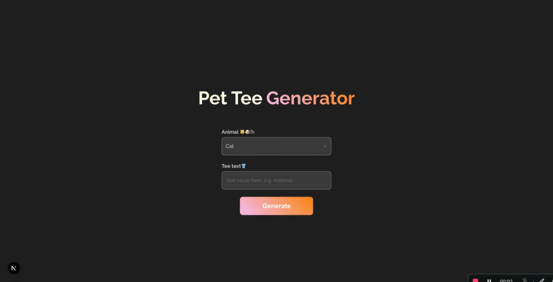
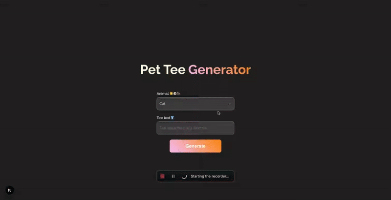

# Pet Tee: AI Image Generator

Pet Tee is an AI-powered image generator that creates images of your chosen pet wearing a T-shirt with custom text. This project is built with Next.js.

## Demo
You can visit: https://pet-tee.vercel.app






## Installation

Pet Tee requires Node.js v18+ to run.
Install the dependencies and start the development server:

```sh
npm i
```

Then, create a .env file based on .env.example:
```sh
REPLICATE_API_TOKEN=YOUR_TOKEN
BASE_API_URL=http://localhost:3000
```

run the app

```sh
npm run dev
```
## Prompt Strategy
I'm adding a dynamic prompt based on what the user wants to implement

> A high-quality studio photograph showing only the upper half of a cute ${animal}, focusing on its chest and face. The ${animal} is wearing a clean, plain white t-shirt with the text "${text}" printed clearly and correctly across the front in Arial font. The text must be fully readable and perfectly spelled. The image is shot in a professional photo studio with soft, diffused lighting and a smooth, neutral gray background. The animal has a friendly, photogenic expression, with natural posture.


## What's Next
To be implemented:
1. Unit tests
2. Gallery of previously generated images
3. Additional animations for user engagement

Credits to cris@kudos.chat
